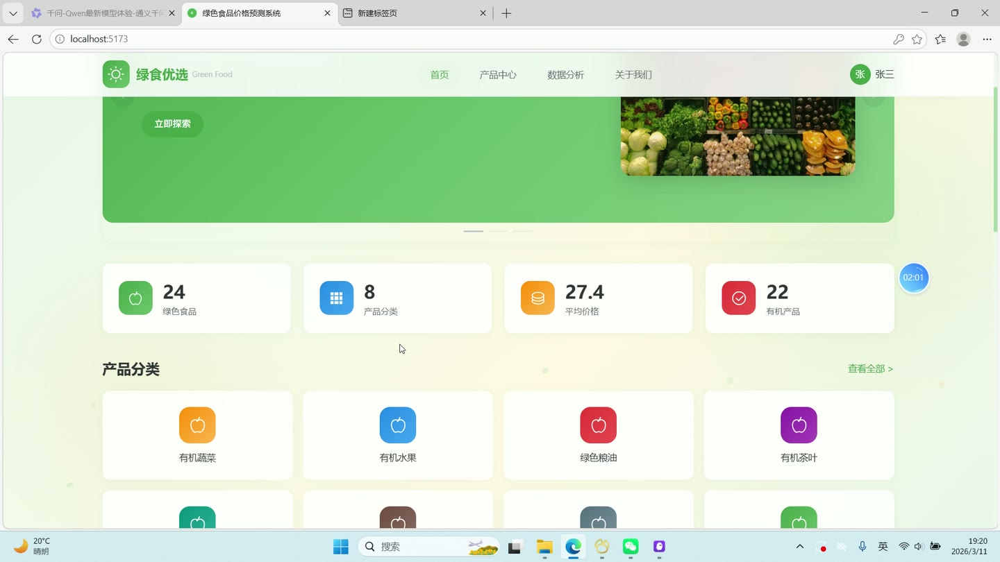
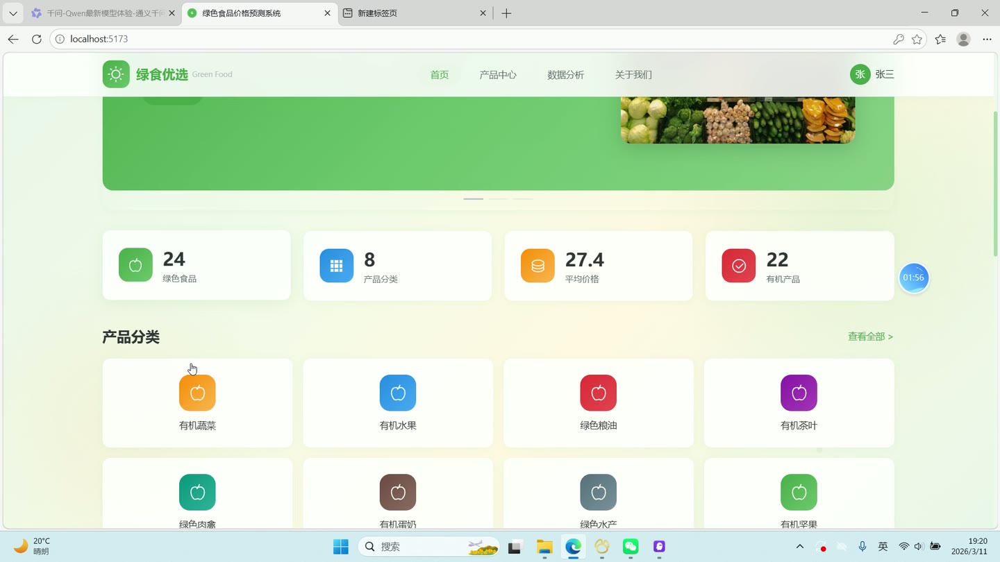
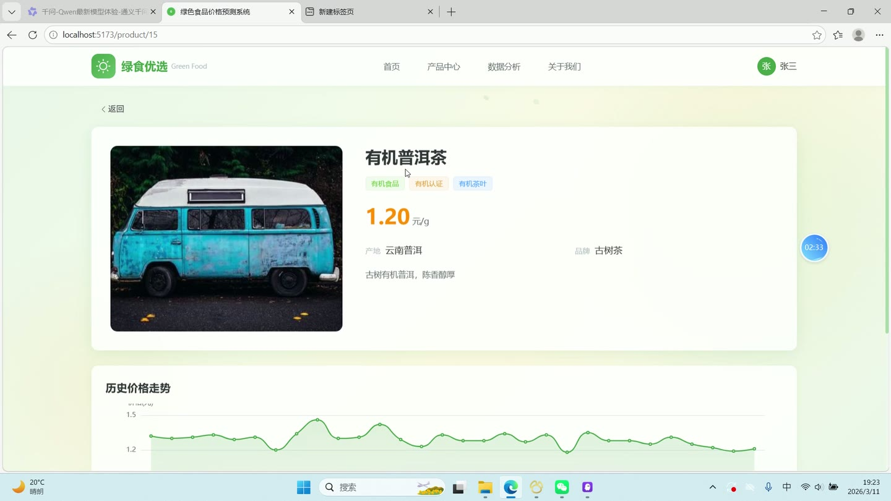

# (附文档)Python+Django+Vue3 基于机器学习的绿色食品价格数据分析可视化与预测系统

**技术栈**：Python、Django、机器学习、Vue3、MySQL

### 系统简介

本系统是一套基于 Django + Vue3 前后端分离架构的绿色食品价格数据分析与预测平台，后端提供 REST 接口，前端分为面向访客的前台展示端与登录后可用的后台管理端。系统内置随机森林机器学习模型，可对绿色食品历史价格进行训练与未来价格预测，并配套数据采集、数据清洗与多维度可视化分析能力，角色分为普通用户与管理员两类。
 
### 核心功能
 
### 普通用户端

 
- 首页数据概览：展示上架食品总数、分类总数、平均价格、有机食品数量，并渲染近 30 天价格走势。 
- 前台食品列表：支持按关键词模糊搜索、按分类筛选，分页浏览已上架绿色食品。 
- 食品详情查看：展示食品名称、分类、产地、品牌、单位、当前价格、认证类型、是否有机及图片。 
- 历史价格查看：在食品详情页查看该食品最近 30 条价格记录，含价格、日期、所属市场与数据来源。 
- 前台分析页：查看分类分布、月度价格、市场对比、价格分布、产地分析等可视化图表。 
- 账号注册：填写用户名与密码完成注册，注册后默认角色为普通用户。 
- 账号登录：输入用户名与密码登录，系统校验密码与账号状态，禁用账号无法登录。 
- 个人资料维护：可更新昵称、邮箱、手机号与头像，头像通过上传接口保存并返回访问地址。 
- 推荐食品浏览：读取已激活的推荐列表，展示推荐食品名称、图片、价格、推荐分数与推荐理由。 
- 关于页面：查看系统介绍与平台说明信息。
 
### 管理员端

 
- 数据看板：统计绿色食品数、分类数、价格记录数、预测记录数与平均价格，并绘制分类饼图、月度趋势折线图、市场均价柱状图与价格分布图。 
- 食品管理：分页查询食品列表，支持关键词与分类筛选，新增、编辑、删除食品，维护名称、分类、产地、品牌、单位、价格、图片、描述、认证类型、是否有机与上下架状态。 
- 食品图片上传：上传图片文件并返回可访问的图片地址，用于食品主图设置。 
- 分类管理：查询分类列表，新增、编辑、删除分类，维护分类名称与排序值。 
- 价格记录管理：按食品筛选价格记录，分页查看价格、市场、来源与记录日期，新增价格记录并删除指定记录。 
- 数据采集任务：查看采集任务列表及状态、总数、成功数、创建与完成时间，选择食品后发起采集，按天生成含季节性波动与噪声的价格数据。 
- 数据清洗：对全部或指定食品的价格数据执行去重与三倍标准差异常值剔除，记录原始数据量、清洗后数量、去重数与异常值移除数。 
- 清洗日志查看：分页查看清洗日志列表，并弹窗查看每次清洗的详细日志内容。 
- 模型训练：选择食品并设置树数量与最大深度，基于历史价格训练随机森林模型，保存训练集分数、测试集分数、MSE、MAE、R2 与特征重要性。 
- 价格预测：选择食品与预测天数，基于历史数据训练后预测未来每日价格，写入预测记录并返回预测结果与评估指标。 
- 预测记录管理：分页查看预测价格、实际价格、预测日期、模型准确率、MSE、MAE 与 R2 分数。 
- 模型列表查看：查看已训练模型的名称、算法、参数、各项评估指标、特征重要性与激活状态。 
- 可视化分析：按食品查看价格趋势，并展示分类分布、月度统计、市场对比、价格分布直方图与产地分析图表。 
- 用户管理：分页查询用户列表，支持关键词搜索，新增、编辑、删除用户，维护昵称、邮箱、手机号、角色、头像、状态与重置密码。
 
### 技术栈

 后端框架Python + Django + Django REST Framework 机器学习随机森林（RandomForest）价格预测，含特征工程与模型评估 数据处理NumPy 直方图分箱、标准差异常值剔除、去重清洗 数据库MySQL 前端框架Vue3（组合式 API） UI 组件Element Plus 图表库ECharts 路由与状态Vue Router + Pinia 构建工具Vite 样式方案SCSS
 
### 交付内容

 
- 后端完整源码 
- 前端完整源码 
- 数据库初始化脚本 
- 万字文档

## 界面展示

---

## 获取完整源码 + 万字文档

本仓库为项目介绍页。**完整前后端源码、数据库初始化脚本、万字项目文档**，请加微信 `kangkangcode`，或访问 [codekk.top](http://codekk.top) 获取。

可作课程设计 / 毕业设计参考，支持远程部署调试。